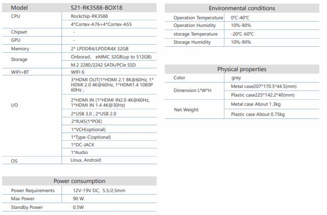
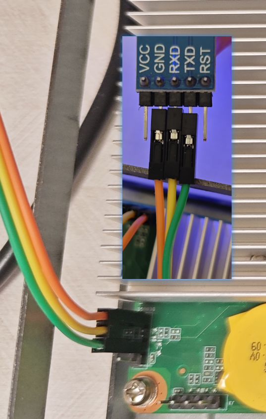
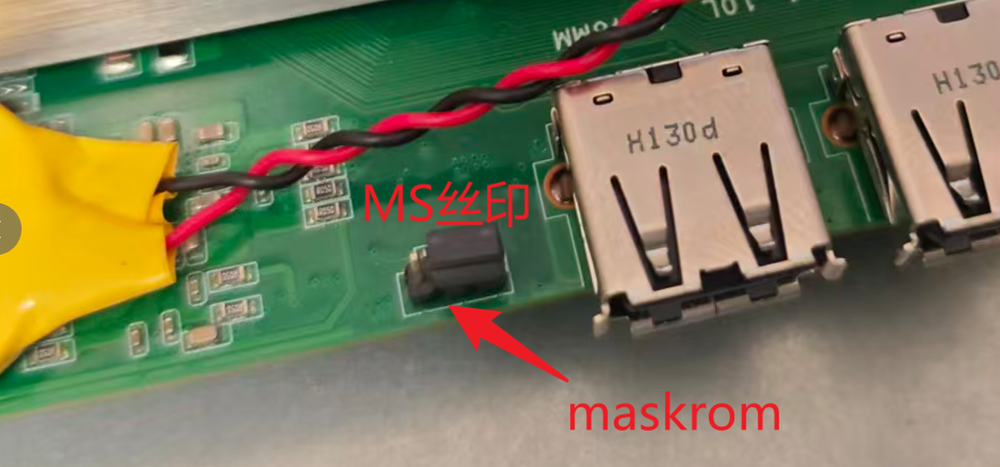

# S21-RK3588-BOX18

## 基本参数

德晟达(<http://www.decenta.cn/>)视频会议终端S21-RK3588-BOX18搭载瑞芯微3588处理器，适用于视频会议中更多的功能扩展包括 AI 同声翻译， 实时会议记录等。三路 HDMI Out 用于视频画面与办公协同三流输出，两路 HDMI In 用于连接云台摄像机和笔记本输入，HUB 接口用于连接会控屏和外设扩展，简单布线实现简约办公。

产品特点：

* 支持HDMI2.0输入 HDMI2.0+HDMI1.4
* 2个USB3.0接口，2个USB2.0接口 USB Type-c接口选配
* 支持8K视频编解码，双显示器4K视频输出
* 支持M.2、SATA多种存储方式

---

## 免责声明

* 按原样提供：镜像不作任何保证，使用风险自负
* 无官方关联：与无官方关系、无任何商业往来
* 安全提示：请及时更新补丁、修改默认密码、配置防火墙

## 目录

* [开发板信息](docs/开发板信息.md)
* [官方固件](docs/官方固件.md)
* [设备树分析](docs/设备树分析.md)
* [official-kdev适配](docs/official-kdev适配.md)
* [third-kdev适配](docs/third-kdev适配.md)
* [rockchip-linux仓库develop-6.1内核适配](docs/rockchip-linux仓库develop-6.1内核适配.md)
* [rockchip-linux仓库develop-6.6内核适配](docs/rockchip-linux仓库develop-6.6内核适配.md)

---

## debug调试口

| 参数 | 值 | 说明 |
|------|----|------|
| 波特率 (Baud Rate) | `1500000` (1.5 Mbps) | 一般配置 |
| 数据位 (Data Bits) | `8` | 标准配置，无例外 |
| 停止位 (Stop Bits) | `1` | 标准配置，极少用 2 |
| 校验位 (Parity) | `None` | 默认无校验（N） |
| 流控 (Flow Control) | `None` | 默认禁用硬件流控（RTS/CTS），除非特别配置 |

## maskrom短接端

跳线帽移动到另一侧即可进入maskrom

## 相关照片

