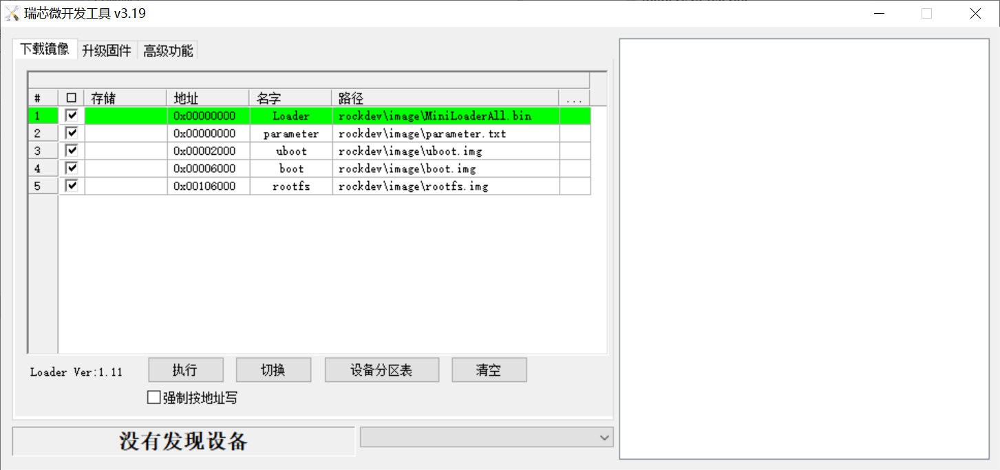

# official-kdev适配

适配目标：

** 使用官方android系统的kernel、内核模块、配合开源发行版的rootfs构建完整系统镜像 **


## 三分区适配 



* uboot采用rockchip-linux仓库即可

```shell
https://github.com/rockchip-linux/u-boot.git

branch: next-dev
```

* 修改配置，默认引导boot分区的extlinux.conf

```shell
# git diff
diff --git a/include/configs/evb_rk3588.h b/include/configs/evb_rk3588.h
index 6685bb5a44..efb44f9a28 100644
--- a/include/configs/evb_rk3588.h
+++ b/include/configs/evb_rk3588.h
@@ -20,7 +20,8 @@
 #define CONFIG_SYS_MMC_ENV_DEV         0
 
 #undef CONFIG_BOOTCOMMAND
-#define CONFIG_BOOTCOMMAND RKIMG_BOOTCOMMAND
+#define CONFIG_BOOTCOMMAND "sysboot mmc 0:2 any 0x00500000 extlinux.conf"
+
 
 #endif
 #endif
```


## 内核模块提取

```shell
root@armbian:/lib/modules/5.10.66# ls -alh *.ko
-rw-r--r-- 1 1001 1001 3.0M Jul 10 04:35 bcmdhd.ko
-rw-r--r-- 1 1001 1001 630K Jul 10 04:35 r8168.ko
root@armbian:/lib/modules/5.10.66#
 ```

从官方镜像中提取ko，其中bcmdhd用于wlan0模块，r8168是另一个千兆网卡

还有一个pgdrv.ko

r8168.ko — 正常网卡驱动

用途：让 RTL8168/8111 系列千兆网卡作为网络接口（eth0等）正常工作，负责收发数据包、链路协商、WoL 等。
使用场景：日常启动后自动加载（modprobe r8168或内核自动绑定），使系统能上网。
来源：Realtek 官方出的 Linux 网卡驱动，替代内核自带 r8169（部分旧硬件更稳定）。

pgdrv.ko — Realtek PG Tool（Programming）驱动

用途：不是用来上网的，是给 Realtek PG Tool（rtnicpg）​ 提供底层访问，用于读写网卡 EEPROM / eFUSE、烧写 MAC 地址、修改 VID/PID、写 Option ROM​ 等量产配置操作。
使用场景：工厂产线或维护时临时加载——必须先 rmmod r8168（或 r8169），再 insmod pgdrv.ko，运行 rtnicpg工具操作完后卸载。
注意：加载 pgdrv后网卡不会有网络接口，不能上网。


## rpc_pipefs挂载报错

启动日志pipefs报错

```shell
         Starting rpcbind.service - RPC bind portmap service...
         Starting systemd-journal-catalog-u…ervice - Rebuild Journal Catalog...
         Starting systemd-resolved.service - Network Name Resolution...
         Starting systemd-update-utmp.servi…ord System Boot/Shutdown in UTMP...
[FAILED] Failed to mount run-rpc_pipefs.mount - RPC Pipe File System.
See 'systemctl status run-rpc_pipefs.mount' for details.
[DEPEND] Dependency failed for rpc_pipefs.target.
[DEPEND] Dependency failed for rpc-gssd.ser… service for NFS client and server.
[  OK  ] Reached target nfs-client.target - NFS client services.
[  OK  ] Started rpcbind.service - RPC bind portmap service.
[  OK  ] Reached target remote-fs-pre.targe…reparation for Remote File Systems.
[  OK  ] Reached target remote-fs.target - Remote File Systems.
```


```shell
root@armbian:~# journalctl -u run-rpc_pipefs.mount --no-pager
Jul 10 05:40:36 armbian systemd[1]: Mounting run-rpc_pipefs.mount - RPC Pipe File System...
Jul 10 05:40:36 armbian mount[673]: mount: /run/rpc_pipefs: unknown filesystem type 'rpc_pipefs'.
Jul 10 05:40:36 armbian mount[673]:        dmesg(1) may have more information after failed mount system call.
Jul 10 05:40:36 armbian systemd[1]: run-rpc_pipefs.mount: Mount process exited, code=exited, status=32/n/a
Jul 10 05:40:36 armbian systemd[1]: run-rpc_pipefs.mount: Failed with result 'exit-code'.
Jul 10 05:40:36 armbian systemd[1]: Failed to mount run-rpc_pipefs.mount - RPC Pipe File System.
root@armbian:~# 

```


默认官方内核不支持rpc_pipefs


```shell
root@armbian:~# 
root@armbian:~# cat /proc/filesystems | grep rpc_pipefs
root@armbian:~# zcat /proc/config.gz |grep rpc_pipefs
root@armbian:~# 
root@armbian:~# 
```


## gpu适配

```shell
root@armbian:/lib/modules/5.10.66# dmesg |grep -i gpu
[   10.533051] vdd_gpu_s0: supplied by vcc5v0_sys
[   10.538120] vdd_gpu_mem_s0: supplied by vcc5v0_sys
[   11.404899] mali fb000000.gpu: Kernel DDK version g11p0-01eac0
[   11.406335] mali fb000000.gpu: Failed to get gpu_leakage
[   11.408456] mali fb000000.gpu: pvtm=922
[   11.408877] mali fb000000.gpu: pvtm-volt-sel=4
[   11.410005] mali fb000000.gpu: avs=0
[   11.411873] W : [File] : drivers/gpu/arm/bifrost/platform/rk/mali_kbase_config_rk.c; [Line] : 132; [Func] : kbase_platform_rk_init(); power-off-delay-ms not available.
[   11.418931] mali fb000000.gpu: r0p0 status 5 is unknown; treating as r0p0 status 0
[   11.421559] mali fb000000.gpu: GPU identified as 0x7 arch 10.8.6 r0p0 status 0
[   11.422850] mali fb000000.gpu: No priority control manager is configured
[   11.426430] mali fb000000.gpu: No memory group manager is configured
[   11.427608] mali fb000000.gpu: Protected memory allocator not available
[   11.434756] mali fb000000.gpu: l=0 h=2147483647 hyst=5000 l_limit=0 h_limit=0 h_table=0
[   11.438626] mali fb000000.gpu: Probed as mali0
[   12.606336] I : [File] : drivers/gpu/arm/mali400/mali/linux/mali_kernel_linux.c; [Line] : 409; [Func] : mali_module_init(); svn_rev_string_from_arm of this mali_ko is '', rk_ko_ver is '5', built at '18:00:09', on 'Apr  1 2022'.
root@armbian:/lib/modules/5.10.66# 
root@armbian:/lib/modules/5.10.66# 
```


## npu适配

```shell
root@armbian:/lib/modules/5.10.66# dmesg |grep -i npu
[   10.534001] vdd_npu_s0: supplied by vcc5v0_sys
[   10.539232] vdd_npu_mem_s0: supplied by vcc5v0_sys
[   10.611423] rk_gmac-dwmac fe1b0000.ethernet: clock input or output? (output).
[   11.169295] input: febd0030.pwm as /devices/platform/febd0030.pwm/input/input0
[   11.173662] input: rk805 pwrkey as /devices/platform/feb20000.spi/spi_master/spi2/spi2.0/rk805-pwrkey.2.auto/input/input1
[   11.318252]     input device check on
[   11.546855] input: adc-keys as /devices/platform/adc-keys/input/input2
[   11.557807] input: rockchip,dp1 rockchip,dp1 as /devices/platform/dp1-sound/sound/card1/input3
[   11.560827] input: rockchip-hdmi0 rockchip-hdmi0 as /devices/platform/hdmi0-sound/sound/card2/input4
[   11.564048] input: rockchip-hdmi1 rockchip-hdmi1 as /devices/platform/hdmi1-sound/sound/card3/input5
[   12.495131] input: PixA? USB Optical Mouse as /devices/platform/fc880000.usb/usb8/8-1/8-1.2/8-1.2:1.0/0003:093A:2510.0001/input/input6
[   12.497335] hid-generic 0003:093A:2510.0001: input,hidraw0: USB HID v1.11 Mouse [PixA? USB Optical Mouse] on usb-fc880000.usb-1.2/input0
[   12.560795] input: rk-headset as /devices/platform/rk-headset/input/input7
[   12.563706] RKNPU fdab0000.npu: Adding to iommu group 0
[   12.565767] RKNPU fdab0000.npu: RKNPU: rknpu iommu is enabled, using iommu mode
[   12.568289] RKNPU fdab0000.npu: can't request region for resource [mem 0xfdab0000-0xfdabffff]
[   12.569891] RKNPU fdab0000.npu: can't request region for resource [mem 0xfdac0000-0xfdacffff]
[   12.571389] RKNPU fdab0000.npu: can't request region for resource [mem 0xfdad0000-0xfdadffff]
[   12.574149] [drm] Initialized rknpu 0.6.4 20211227 for fdab0000.npu on minor 1
[   12.578238] RKNPU fdab0000.npu: Failed to get npu_leakage
[   12.580514] RKNPU fdab0000.npu: pvtm=899
[   12.581162] RKNPU fdab0000.npu: pvtm-volt-sel=3
[   12.584642] RKNPU fdab0000.npu: avs=0
[   12.585603] RKNPU fdab0000.npu: l=0 h=2147483647 hyst=5000 l_limit=0 h_limit=0 h_table=0
[   12.587164] RKNPU fdab0000.npu: failed to find power_model node
[   12.587993] RKNPU fdab0000.npu: RKNPU: failed to initialize power model
[   12.589230] RKNPU fdab0000.npu: RKNPU: failed to get dynamic-coefficient
root@armbian:/lib/modules/5.10.66# 
```


---


